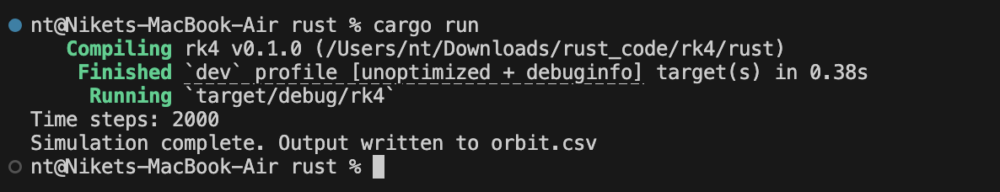

# RUST / Python code implementation

1. 

Classes Program 1 (2nd derivative of e^x)

1. Input parameters : h(initial step size), x(point of eval), n (number of steps, halves of h)
2. 2 lists created : for step sizes and for corresponding values of second derivatives
3. For n iterations:
    - Compute derivative by cntral difference formula
    - Append  h and approximation to the corresponding lists
    - Half h for next iteration
4. Calculate error by computing true value and for each approximation compute relative error
5. Write step size and relative error to file

-   

    
RUST implementation

    <pre><code class="language-rust">
    use std::fs::File;
    use std::io::{self, Write, BufRead};
    use std::f64::consts::E;

    use std::f64;

    fn main() {
        let stdin = io::stdin();

        println!("Initial stepsize:");
        let initial_step = read_input(&stdin).trim().parse::<f64>().unwrap();

        println!("Evaluate at point x:");
        let x = read_input(&stdin).trim().parse::<f64>().unwrap();

        println!("Number of steps (stepsize will be halved each iteration):");
        let number_of_steps = read_input(&stdin).trim().parse::<usize>().unwrap();

        let (h_steps, computed_derivatives) = compute_second_derivative(number_of_steps, x, initial_step);

        write_output(&h_steps, &computed_derivatives, x).expect("Failed to write to file");
    }

    fn read_input(stdin: &io::Stdin) -> String {
        let mut line = String::new();
        stdin.lock().read_line(&mut line).unwrap();
        line
    }

    fn compute_second_derivative(n: usize, x: f64, mut h: f64) -> (Vec<f64>, Vec<f64>) {
        let mut h_steps = Vec::with_capacity(n);
        let mut computed = Vec::with_capacity(n);
        for _ in 0..n {
            h_steps.push(h);
            let deriv = (f64::exp(x + h) - 2.0 * f64::exp(x) + f64::exp(x - h)) / (h * h);
            computed.push(deriv);
            h /= 2.0;
        }
        (h_steps, computed)
    }

    fn write_output(h_steps: &Vec<f64>, computed: &Vec<f64>, x: f64) -> io::Result<()> {
        let mut file = File::create("out.dat")?;
        for (h, approx) in h_steps.iter().zip(computed.iter()) {
            let rel_error = (approx - f64::exp(x)).abs() / f64::exp(x);
            writeln!(file, "{:.6} {:12.5e}", h.log10(), rel_error.log10())?;
        }
        Ok(())
    }
    </code></pre>

    ### Output

    
    

    

-   

    
Python implementation

    <pre><code class="language-python">
    def factorial(n):
        result = 1
        for i in range(2, n + 1):
            result *= i
        return result

    def exp_approx(x, terms=20):
        total = 0.0
        for k in range(terms):
            total += (x ** k) / factorial(k)
        return total

    def compute_second_derivative(n, x, h):
        h_steps = []
        computed = []
        for _ in range(n):
            h_steps.append(h)
            approx = (exp_approx(x + h) - 2 * exp_approx(x) + exp_approx(x - h)) / (h * h)
            computed.append(approx)
            h /= 2
        return h_steps, computed

    def write_output(h_steps, computed, x):
        with open("out.dat", "w") as f:
            true_val = exp_approx(x)
            for h, approx in zip(h_steps, computed):
                rel_error = abs(approx - true_val) / true_val
                f.write(f"{h:.6e} {rel_error:.5e}\n")

    initial_step = float(input("Initial stepsize: "))
    x = float(input("Evaluate at point x: "))
    number_of_steps = int(input("Number of steps: "))

    h_steps, computed = compute_second_derivative(number_of_steps, x, initial_step)
    write_output(h_steps, computed, x)
    print("Results written to out.dat")
    </code></pre>

    ### Output

    
    
    
    

2. 

Classes Program 2 (Copy contents of inputfile to outputfile)

1. Take in arguments from command line : input file and output file.
2. Attempt to open the input file for reading and exit if it fails
3. Create or open the output file for writing
4. Read the input file line-by-line and write each line to the output file

-   

    
RUST implementation

    <pre><code class="language-rust">
    use std::env;
    use std::fs::File;
    use std::io::{self, BufRead, BufReader, Write};

    fn main() {
        let args: Vec<String> = env::args().collect();
        if args.len() != 3 {
            eprintln!("Usage: {} <infile> <outfile>", args[0]);
            std::process::exit(1);
        }
        let infile_name = &args[1];
        let outfile_name = &args[2];
        let infile = File::open(infile_name).unwrap_or_else(|_| {
            eprintln!("Oops! Could not read {}", infile_name);
            std::process::exit(1);
        });
        let reader = BufReader::new(infile);
        let mut outfile = File::create(outfile_name).unwrap_or_else(|_| {
            eprintln!("Oops! Could not open {} for writing", outfile_name);
            std::process::exit(1);
        });
        for line in reader.lines() {
            match line {
                Ok(content) => {
                    writeln!(outfile, "{}", content).unwrap();
                }
                Err(e) => {
                    eprintln!("Error reading line: {}", e);
                }
            }
        }
        println!("Copied contents from {} to {}", infile_name, outfile_name);
    }
    </code></pre>

    ### Output

    
    

    

-   

    
Python implementation

    <pre><code class="language-python">
    import sys

    if len(sys.argv) != 3:
        print(f"Usage: {sys.argv[0]} <infile> <outfile>")
        sys.exit(1)

    infile_name = sys.argv[1]
    outfile_name = sys.argv[2]

    try:
        with open(infile_name, 'r') as infile:
            try:
                with open(outfile_name, 'w') as outfile:
                    for line in infile:
                        outfile.write(line)
            except IOError:
                print(f"Oops! Could not open {outfile_name} for writing")
                sys.exit(1)
    except IOError:
        print(f"Oops! Could not read {infile_name}")
        sys.exit(1)

    print(f"Copied contents from {infile_name} to {outfile_name}")
    </code></pre>

    ### Output

    
    
    
    

3. 

Classes Program SunEarth (Orbital motion under Newtonian gravity using Euler's method)

1. Initialize the parameters
    - m: total simulation time
    - dt: time step
    - t0: initial tile
    - (x,y): (1.0,0.0)
    - velocity (vx, vy): (2*pi , 0)
2. Iterate over time
    - For each time step, compute new position based on current velocity
    - Update the velocity based on gravitational accelaration
3. Calculate derived values i.e. radius and speed
4. Store values at each time step: t, r, v and write them in a file

-   

    
RUST implementation

    <pre><code class="language-rust">
    use std::fs::File;
    use std::io::{self, Write};
    use std::f64::consts::PI;

    fn solver(m: f64, dt: f64, t0: f64) -> (Vec<f64>, Vec<f64>, Vec<f64>) {
        let num_intervals = (m / dt).round() as usize;
        println!("Time steps: {}", num_intervals);

        let mut t: Vec<f64> = Vec::with_capacity(num_intervals + 1);
        let mut x: Vec<f64> = Vec::with_capacity(num_intervals + 1);
        let mut y: Vec<f64> = Vec::with_capacity(num_intervals + 1);
        let mut vx: Vec<f64> = Vec::with_capacity(num_intervals + 1);
        let mut vy: Vec<f64> = Vec::with_capacity(num_intervals + 1);
        let mut r: Vec<f64> = Vec::with_capacity(num_intervals + 1);
        let mut v: Vec<f64> = Vec::with_capacity(num_intervals + 1);

        let pi4 = 4.0 * PI * PI;

        t.push(t0);
        x.push(1.0);
        y.push(0.0);
        vx.push(2.0 * PI);
        vy.push(0.0);
        r.push((x[0] * x[0] + y[0] * y[0]).sqrt());
        v.push((vx[0] * vx[0] + vy[0] * vy[0]).sqrt());

        for n in 0..num_intervals {
            let tn = t0 + (n as f64 + 1.0) * dt;
            t.push(tn);

            let xn = x[n] + dt * vx[n];
            let yn = y[n] + dt * vy[n];
            x.push(xn);
            y.push(yn);

            let r3 = (xn * xn + yn * yn).powf(1.5);
            let vxn = vx[n] - dt * pi4 * xn / r3;
            let vyn = vy[n] - dt * pi4 * yn / r3;
            vx.push(vxn);
            vy.push(vyn);

            v.push((vxn * vxn + vyn * vyn).sqrt());
            r.push((xn * xn + yn * yn).sqrt());
        }

        (r, v, t)
    }

    fn save_to_csv(filename: &str, t: &[f64], r: &[f64], v: &[f64]) -> io::Result<()> {
        let mut file = File::create(filename)?;
        writeln!(file, "time,radius,speed")?;
        for i in 0..t.len() {
            writeln!(file, "{:.5},{:.5},{:.5}", t[i], r[i], v[i])?;
        }
        Ok(())
    }

    fn main() {
        let m = 20.0;
        let dt = 0.01;
        let t0 = 0.0;

        let (r, v, t) = solver(m, dt, t0);

        if let Err(e) = save_to_csv("orbit.csv", &t, &r, &v) {
            eprintln!("Failed to save data: {}", e);
        } else {
            println!("Simulation complete. Output written to orbit.csv");
        }
    }
    </code></pre>

    ### Output

    
    

    

-   

    
Python implementation

    <pre><code class="language-python">
    import csv

    PI = 3.141592653589793
    PI4 = 4 * PI * PI

    def solver(m, dt, t0):
        num_intervals = round(m / dt)
        print(f"Time steps: {num_intervals}")

        t = [t0]
        x = [1.0]
        y = [0.0]
        vx = [2.0 * PI]
        vy = [0.0]
        r = [(x[0]**2 + y[0]**2)**0.5]
        v = [(vx[0]**2 + vy[0]**2)**0.5]

        for n in range(num_intervals):
            tn = t0 + (n + 1) * dt
            t.append(tn)

            xn = x[n] + dt * vx[n]
            yn = y[n] + dt * vy[n]
            x.append(xn)
            y.append(yn)

            r3 = (xn**2 + yn**2)**1.5
            vxn = vx[n] - dt * PI4 * xn / r3
            vyn = vy[n] - dt * PI4 * yn / r3
            vx.append(vxn)
            vy.append(vyn)

            v.append((vxn**2 + vyn**2)**0.5)
            r.append((xn**2 + yn**2)**0.5)

        return r, v, t

    def save_to_csv(filename, t, r, v):
        with open(filename, 'w', newline='') as file:
            writer = csv.writer(file)
            writer.writerow(['time', 'radius', 'speed'])
            for i in range(len(t)):
                writer.writerow([f"{t[i]:.5f}", f"{r[i]:.5f}", f"{v[i]:.5f}"])

    m = 20.0
    dt = 0.01
    t0 = 0.0

    r, v, t = solver(m, dt, t0)

    try:
        save_to_csv("orbit.csv", t, r, v)
        print("Simulation complete. Output written to orbit.csv")
    except IOError as e:
        print(f"Failed to save data: {e}")
    </code></pre>

    ### Output

    
    
    
    

