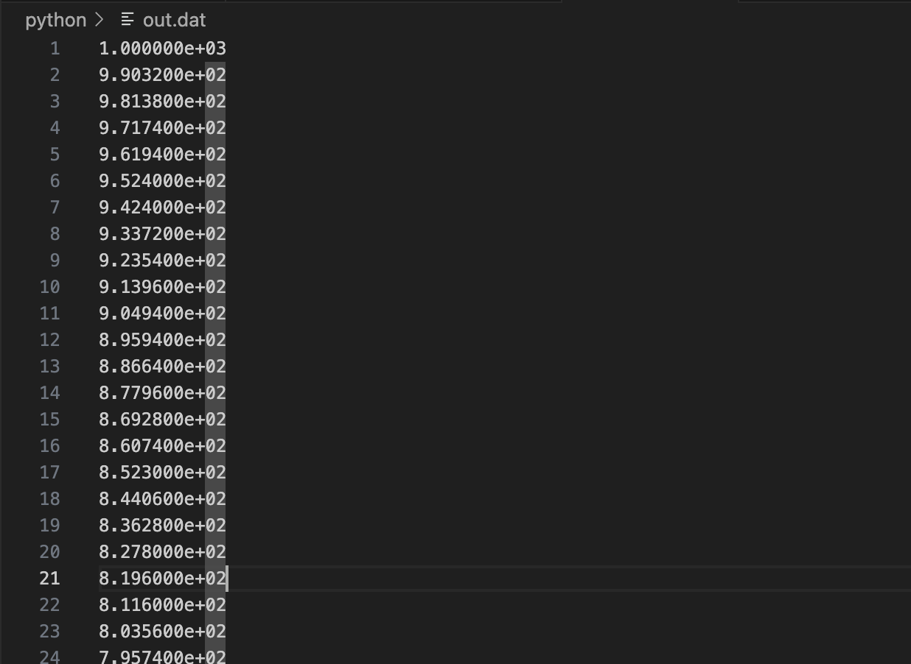

# RUST / Python code implementation

1. 

Classes Program 1 (2nd derivative of e^x)

1. Input parameters : h(initial step size), x(point of eval), n (number of steps, halves of h)
2. 2 lists created : for step sizes and for corresponding values of second derivatives
3. For n iterations:
    - Compute derivative by cntral difference formula
    - Append  h and approximation to the corresponding lists
    - Half h for next iteration
4. Calculate error by computing true value and for each approximation compute relative error
5. Write step size and relative error to file

-   

    
RUST implementation

    <pre><code class="language-rust">
    use std::fs::File;
    use std::io::{self, Write, BufRead};
    use std::f64::consts::E;

    use std::f64;

    fn main() {
        let stdin = io::stdin();

        println!("Initial stepsize:");
        let initial_step = read_input(&stdin).trim().parse::<f64>().unwrap();

        println!("Evaluate at point x:");
        let x = read_input(&stdin).trim().parse::<f64>().unwrap();

        println!("Number of steps (stepsize will be halved each iteration):");
        let number_of_steps = read_input(&stdin).trim().parse::<usize>().unwrap();

        let (h_steps, computed_derivatives) = compute_second_derivative(number_of_steps, x, initial_step);

        write_output(&h_steps, &computed_derivatives, x).expect("Failed to write to file");
    }

    fn read_input(stdin: &io::Stdin) -> String {
        let mut line = String::new();
        stdin.lock().read_line(&mut line).unwrap();
        line
    }

    fn compute_second_derivative(n: usize, x: f64, mut h: f64) -> (Vec<f64>, Vec<f64>) {
        let mut h_steps = Vec::with_capacity(n);
        let mut computed = Vec::with_capacity(n);
        for _ in 0..n {
            h_steps.push(h);
            let deriv = (f64::exp(x + h) - 2.0 * f64::exp(x) + f64::exp(x - h)) / (h * h);
            computed.push(deriv);
            h /= 2.0;
        }
        (h_steps, computed)
    }

    fn write_output(h_steps: &Vec<f64>, computed: &Vec<f64>, x: f64) -> io::Result<()> {
        let mut file = File::create("out.dat")?;
        for (h, approx) in h_steps.iter().zip(computed.iter()) {
            let rel_error = (approx - f64::exp(x)).abs() / f64::exp(x);
            writeln!(file, "{:.6} {:12.5e}", h.log10(), rel_error.log10())?;
        }
        Ok(())
    }
    </code></pre>

    ### Output

    
    

    

-   

    
Python implementation

    <pre><code class="language-python">
    def factorial(n):
        result = 1
        for i in range(2, n + 1):
            result *= i
        return result

    def exp_approx(x, terms=20):
        total = 0.0
        for k in range(terms):
            total += (x ** k) / factorial(k)
        return total

    def compute_second_derivative(n, x, h):
        h_steps = []
        computed = []
        for _ in range(n):
            h_steps.append(h)
            approx = (exp_approx(x + h) - 2 * exp_approx(x) + exp_approx(x - h)) / (h * h)
            computed.append(approx)
            h /= 2
        return h_steps, computed

    def write_output(h_steps, computed, x):
        with open("out.dat", "w") as f:
            true_val = exp_approx(x)
            for h, approx in zip(h_steps, computed):
                rel_error = abs(approx - true_val) / true_val
                f.write(f"{h:.6e} {rel_error:.5e}\n")

    initial_step = float(input("Initial stepsize: "))
    x = float(input("Evaluate at point x: "))
    number_of_steps = int(input("Number of steps: "))

    h_steps, computed = compute_second_derivative(number_of_steps, x, initial_step)
    write_output(h_steps, computed, x)
    print("Results written to out.dat")
    </code></pre>

    ### Output

    
    
    
    

2. 

Classes Program 2 (Copy contents of inputfile to outputfile)

1. Take in arguments from command line : input file and output file.
2. Attempt to open the input file for reading and exit if it fails
3. Create or open the output file for writing
4. Read the input file line-by-line and write each line to the output file

-   

    
RUST implementation

    <pre><code class="language-rust">
    use std::env;
    use std::fs::File;
    use std::io::{self, BufRead, BufReader, Write};

    fn main() {
        let args: Vec<String> = env::args().collect();
        if args.len() != 3 {
            eprintln!("Usage: {} <infile> <outfile>", args[0]);
            std::process::exit(1);
        }
        let infile_name = &args[1];
        let outfile_name = &args[2];
        let infile = File::open(infile_name).unwrap_or_else(|_| {
            eprintln!("Oops! Could not read {}", infile_name);
            std::process::exit(1);
        });
        let reader = BufReader::new(infile);
        let mut outfile = File::create(outfile_name).unwrap_or_else(|_| {
            eprintln!("Oops! Could not open {} for writing", outfile_name);
            std::process::exit(1);
        });
        for line in reader.lines() {
            match line {
                Ok(content) => {
                    writeln!(outfile, "{}", content).unwrap();
                }
                Err(e) => {
                    eprintln!("Error reading line: {}", e);
                }
            }
        }
        println!("Copied contents from {} to {}", infile_name, outfile_name);
    }
    </code></pre>

    ### Output

    
    

    

-   

    
Python implementation

    <pre><code class="language-python">
    import sys

    if len(sys.argv) != 3:
        print(f"Usage: {sys.argv[0]} <infile> <outfile>")
        sys.exit(1)

    infile_name = sys.argv[1]
    outfile_name = sys.argv[2]

    try:
        with open(infile_name, 'r') as infile:
            try:
                with open(outfile_name, 'w') as outfile:
                    for line in infile:
                        outfile.write(line)
            except IOError:
                print(f"Oops! Could not open {outfile_name} for writing")
                sys.exit(1)
    except IOError:
        print(f"Oops! Could not read {infile_name}")
        sys.exit(1)

    print(f"Copied contents from {infile_name} to {outfile_name}")
    </code></pre>

    ### Output

    
    
    
    

3. 

Classes Program SunEarth (Orbital motion under Newtonian gravity using Euler's method)

1. Initialize the parameters
    - m: total simulation time
    - dt: time step
    - t0: initial tile
    - (x,y): (1.0,0.0)
    - velocity (vx, vy): (2*pi , 0)
2. Iterate over time
    - For each time step, compute new position based on current velocity
    - Update the velocity based on gravitational accelaration
3. Calculate derived values i.e. radius and speed
4. Store values at each time step: t, r, v and write them in a file

-   

    
RUST implementation

    <pre><code class="language-rust">
    use std::fs::File;
    use std::io::{self, Write};
    use std::f64::consts::PI;

    fn solver(m: f64, dt: f64, t0: f64) -> (Vec<f64>, Vec<f64>, Vec<f64>) {
        let num_intervals = (m / dt).round() as usize;
        println!("Time steps: {}", num_intervals);

        let mut t: Vec<f64> = Vec::with_capacity(num_intervals + 1);
        let mut x: Vec<f64> = Vec::with_capacity(num_intervals + 1);
        let mut y: Vec<f64> = Vec::with_capacity(num_intervals + 1);
        let mut vx: Vec<f64> = Vec::with_capacity(num_intervals + 1);
        let mut vy: Vec<f64> = Vec::with_capacity(num_intervals + 1);
        let mut r: Vec<f64> = Vec::with_capacity(num_intervals + 1);
        let mut v: Vec<f64> = Vec::with_capacity(num_intervals + 1);

        let pi4 = 4.0 * PI * PI;

        t.push(t0);
        x.push(1.0);
        y.push(0.0);
        vx.push(2.0 * PI);
        vy.push(0.0);
        r.push((x[0] * x[0] + y[0] * y[0]).sqrt());
        v.push((vx[0] * vx[0] + vy[0] * vy[0]).sqrt());

        for n in 0..num_intervals {
            let tn = t0 + (n as f64 + 1.0) * dt;
            t.push(tn);

            let xn = x[n] + dt * vx[n];
            let yn = y[n] + dt * vy[n];
            x.push(xn);
            y.push(yn);

            let r3 = (xn * xn + yn * yn).powf(1.5);
            let vxn = vx[n] - dt * pi4 * xn / r3;
            let vyn = vy[n] - dt * pi4 * yn / r3;
            vx.push(vxn);
            vy.push(vyn);

            v.push((vxn * vxn + vyn * vyn).sqrt());
            r.push((xn * xn + yn * yn).sqrt());
        }

        (r, v, t)
    }

    fn save_to_csv(filename: &str, t: &[f64], r: &[f64], v: &[f64]) -> io::Result<()> {
        let mut file = File::create(filename)?;
        writeln!(file, "time,radius,speed")?;
        for i in 0..t.len() {
            writeln!(file, "{:.5},{:.5},{:.5}", t[i], r[i], v[i])?;
        }
        Ok(())
    }

    fn main() {
        let m = 20.0;
        let dt = 0.01;
        let t0 = 0.0;

        let (r, v, t) = solver(m, dt, t0);

        if let Err(e) = save_to_csv("orbit.csv", &t, &r, &v) {
            eprintln!("Failed to save data: {}", e);
        } else {
            println!("Simulation complete. Output written to orbit.csv");
        }
    }
    </code></pre>

    ### Output

    
    

    

-   

    
Python implementation

    <pre><code class="language-python">
    import csv

    PI = 3.141592653589793
    PI4 = 4 * PI * PI

    def solver(m, dt, t0):
        num_intervals = round(m / dt)
        print(f"Time steps: {num_intervals}")

        t = [t0]
        x = [1.0]
        y = [0.0]
        vx = [2.0 * PI]
        vy = [0.0]
        r = [(x[0]**2 + y[0]**2)**0.5]
        v = [(vx[0]**2 + vy[0]**2)**0.5]

        for n in range(num_intervals):
            tn = t0 + (n + 1) * dt
            t.append(tn)

            xn = x[n] + dt * vx[n]
            yn = y[n] + dt * vy[n]
            x.append(xn)
            y.append(yn)

            r3 = (xn**2 + yn**2)**1.5
            vxn = vx[n] - dt * PI4 * xn / r3
            vyn = vy[n] - dt * PI4 * yn / r3
            vx.append(vxn)
            vy.append(vyn)

            v.append((vxn**2 + vyn**2)**0.5)
            r.append((xn**2 + yn**2)**0.5)

        return r, v, t

    def save_to_csv(filename, t, r, v):
        with open(filename, 'w', newline='') as file:
            writer = csv.writer(file)
            writer.writerow(['time', 'radius', 'speed'])
            for i in range(len(t)):
                writer.writerow([f"{t[i]:.5f}", f"{r[i]:.5f}", f"{v[i]:.5f}"])

    m = 20.0
    dt = 0.01
    t0 = 0.0

    r, v, t = solver(m, dt, t0)

    try:
        save_to_csv("orbit.csv", t, r, v)
        print("Simulation complete. Output written to orbit.csv")
    except IOError as e:
        print(f"Failed to save data: {e}")
    </code></pre>

    ### Output

    
    
    
    

4. 

Eigen Values for a square

1. Read input matrix of size n from user ( A matrix )
2. Decompose A matrix into an orthogonal matrix Q and upper triangular matrix R.
3. Set A  = R x Q
4. Repeat the steps 2 and 3 for a set number of times
5. Diagonal elements of A represent approximate eigenvalues

-   

    
RUST implementation

    <pre><code class="language-rust">
    use std::io;

    fn main() {
        println!("Enter matrix size n:");

        let mut input = String::new();
        io::stdin().read_line(&mut input).unwrap();
        let n: usize = input.trim().parse().unwrap();

        let mut matrix = vec![vec![0.0; n]; n];
        println!("Enter the matrix elements row by row:");

        for i in 0..n {
            input.clear();
            println!("Row {}:", i + 1);
            io::stdin().read_line(&mut input).unwrap();
            let row: Vec<f64> = input
                .trim()
                .split_whitespace()
                .map(|x| x.parse().unwrap())
                .collect();
            matrix[i] = row;
        }

        println!("\nMatrix:");
        for row in &matrix {
            println!("{:?}", row);
        }

        let eigenvalues = qr_algorithm(matrix, 100);
        println!("\nApproximated Eigenvalues:");
        for (i, lambda) in eigenvalues.iter().enumerate() {
            println!("lambda{} ≈ {:.6}", i + 1, lambda);
        }
    }

    fn transpose(a: &Vec<Vec<f64>>) -> Vec<Vec<f64>> {
        let n = a.len();
        let mut result = vec![vec![0.0; n]; n];
        for i in 0..n {
            for j in 0..n {
                result[j][i] = a[i][j];
            }
        }
        result
    }

    fn mat_mul(a: &Vec<Vec<f64>>, b: &Vec<Vec<f64>>) -> Vec<Vec<f64>> {
        let n = a.len();
        let mut result = vec![vec![0.0; n]; n];
        for i in 0..n {
            for j in 0..n {
                for k in 0..n {
                    result[i][j] += a[i][k] * b[k][j];
                }
            }
        }
        result
    }

    fn qr_decomposition(a: Vec<Vec<f64>>) -> (Vec<Vec<f64>>, Vec<Vec<f64>>) {
        let n = a.len();
        let mut q = vec![vec![0.0; n]; n];
        let mut r = vec![vec![0.0; n]; n];
        let mut a_t = transpose(&a);

        for i in 0..n {
            let mut v = a_t[i].clone();

            for j in 0..i {
                let dot = dot_product(&a_t[i], &q[j]);
                r[j][i] = dot;
                for k in 0..n {
                    v[k] -= dot * q[j][k];
                }
            }

            let norm = (v.iter().map(|x| x * x).sum::<f64>()).sqrt();
            for k in 0..n {
                q[i][k] = v[k] / norm;
            }
            r[i][i] = norm;
        }

        (transpose(&q), r)
    }

    fn dot_product(a: &Vec<f64>, b: &Vec<f64>) -> f64 {
        a.iter().zip(b).map(|(x, y)| x * y).sum()
    }

    fn qr_algorithm(mut a: Vec<Vec<f64>>, iterations: usize) -> Vec<f64> {
        for _ in 0..iterations {
            let (q, r) = qr_decomposition(a.clone());
            a = mat_mul(&r, &q);
        }
        (0..a.len()).map(|i| a[i][i]).collect()
    }
    </code></pre>

    ### Output

    

    

-   

    
Python implementation

    <pre><code class="language-python">
    def transpose(matrix):
        return [list(row) for row in zip(*matrix)]

    def dot_product(a, b):
        return sum(x * y for x, y in zip(a, b))

    def mat_mul(a, b):
        n = len(a)
        result = [[0.0] * n for _ in range(n)]
        for i in range(n):
            for j in range(n):
                for k in range(n):
                    result[i][j] += a[i][k] * b[k][j]
        return result

    def qr_decomposition(a):
        n = len(a)
        q = [[0.0] * n for _ in range(n)]
        r = [[0.0] * n for _ in range(n)]
        a_t = transpose(a)

        for i in range(n):
            v = a_t[i][:]
            for j in range(i):
                dot = dot_product(a_t[i], q[j])
                r[j][i] = dot
                for k in range(n):
                    v[k] -= dot * q[j][k]
            norm = sum(x**2 for x in v)**0.5
            for k in range(n):
                q[i][k] = v[k] / norm
            r[i][i] = norm

        return transpose(q), r

    def qr_algorithm(a, iterations):
        for _ in range(iterations):
            q, r = qr_decomposition(a)
            a = mat_mul(r, q)
        return [a[i][i] for i in range(len(a))]

    n = int(input("Enter matrix size n: "))
    matrix = []
    print("Enter the matrix elements row by row:")
    for i in range(n):
        row = list(map(float, input(f"Row {i+1}: ").strip().split()))
        matrix.append(row)

    print("\nMatrix:")
    for row in matrix:
        print(row)

    eigenvalues = qr_algorithm(matrix, 100)

    print("\nApproximated Eigenvalues:")
    for i, lam in enumerate(eigenvalues):
        print(f"lambda{i+1} ≈ {lam:.6f}")
    </code></pre>

    ### Output

    
    
    

5. 

RootSearching

Methods:
    - Bisection Method
        1. Choose interval [a,b] such as f(a) . f(b) < 0
        2. Compute the middle point c = (a+b)/2
        3. If f(c) is close enough to 0, return c
        4. Replace either a or b dpending on sign if f(c)
        5. Repeat until tolerance or max iterations reached
    
    - Secant Method
        1. Start with 2 initial guesses x0 and x1
        2. Compute next point x2
        3. If |x2 - x1| < tolerence, return x2
        4. Set x0 = x1 and x1 = x2
        5. Repeact until convergence
    
    - Newton-Raphson Method
        1. Start with initial guess x0
        2. Compute x1
        3. If |x1 - x0| < tolerence, return x1
        4. Set x0 = x1
        5. Repeat until convergence or derivative too small

-   

    
RUST implementation

    <pre><code class="language-rust">
    fn func(x: f64) -> f64 {
        x.powi(3) - x - 2.0
    }

    fn func_derivative(x: f64) -> f64 {
        3.0 * x.powi(2) - 1.0
    }

    fn bisection(f: fn(f64) -> f64, mut a: f64, mut b: f64, tol: f64, nmax: usize) -> Option<f64> {
        for n in 1..=nmax {
            let c = (a + b) / 2.0;
            println!("n={}\ta={:.6}\tb={:.6}\tc={:.6}\tf(c)={:.6}", n, a, b, c, f(c));
            if f(c).abs() < tol || (b - a).abs() / 2.0 < tol {
                return Some(c);
            }

            if f(c) * f(a) > 0.0 {
                a = c;
            } else {
                b = c;
            }
        }
        None
    }

    fn secant(f: fn(f64) -> f64, mut x0: f64, mut x1: f64, tol: f64, nmax: usize) -> Option<f64> {
        for n in 1..=nmax {
            let f_x0 = f(x0);
            let f_x1 = f(x1);
            if (f_x1 - f_x0).abs() < tol {
                return None;
            }

            let x2 = x1 - f_x1 * (x1 - x0) / (f_x1 - f_x0);
            println!("n={}\tx0={:.6}\tx1={:.6}\tx2={:.6}\tf(x2)={:.6}", n, x0, x1, x2, f(x2));

            if (x2 - x1).abs() < tol {
                return Some(x2);
            }

            x0 = x1;
            x1 = x2;
        }
        None
    }

    fn newton_raphson(f: fn(f64) -> f64, f_prime: fn(f64) -> f64, mut x0: f64, tol: f64, nmax: usize) -> Option<f64> {
        for n in 1..=nmax {
            let fx = f(x0);
            let fpx = f_prime(x0);

            if fpx.abs() < tol {
                return None;
            }

            let x1 = x0 - fx / fpx;
            println!("n={}\tx0={:.6}\tx1={:.6}\tf(x1)={:.6}", n, x0, x1, f(x1));

            if (x1 - x0).abs() < tol {
                return Some(x1);
            }

            x0 = x1;
        }
        None
    }

    fn main() {
        let tol = 0.001;
        let nmax = 100;

        println!("Bisection Method");
        if let Some(root) = bisection(func, 1.0, 2.0, tol, nmax) {
            println!("Root found by Bisection: {:.6}", root);
        } else {
            println!("Bisection failed to converge");
        }

        println!("Secant Method");
        if let Some(root) = secant(func, 1.0, 2.0, tol, nmax) {
            println!("Root found by Secant: {:.6}", root);
        } else {
            println!("Secant failed to converge");
        }

        println!("Newton-Raphson Method");
        if let Some(root) = newton_raphson(func, func_derivative, 1.0, tol, nmax) {
            println!("Root found by Newton-Raphson: {:.6}", root);
        } else {
            println!("Newton-Raphson failed to converge");
        }
    }
    </code></pre>

    ### Output

    

    

-   

    
Python implementation

    <pre><code class="language-python">
    def func(x):
        return x**3 - x - 2

    def func_derivative(x):
        return 3 * x**2 - 1

    def bisection(f, a, b, tol, nmax):
        for n in range(1, nmax + 1):
            c = (a + b) / 2.0
            print(f"n={n}\ta={a:.6f}\tb={b:.6f}\tc={c:.6f}\tf(c)={f(c):.6f}")
            if abs(f(c)) < tol or abs(b - a) / 2.0 < tol:
                return c
            if f(c) * f(a) > 0:
                a = c
            else:
                b = c
        return None

    def secant(f, x0, x1, tol, nmax):
        for n in range(1, nmax + 1):
            f_x0 = f(x0)
            f_x1 = f(x1)
            if abs(f_x1 - f_x0) < tol:
                return None
            x2 = x1 - f_x1 * (x1 - x0) / (f_x1 - f_x0)
            print(f"n={n}\tx0={x0:.6f}\tx1={x1:.6f}\tx2={x2:.6f}\tf(x2)={f(x2):.6f}")
            if abs(x2 - x1) < tol:
                return x2
            x0 = x1
            x1 = x2
        return None

    def newton_raphson(f, f_prime, x0, tol, nmax):
        for n in range(1, nmax + 1):
            fx = f(x0)
            fpx = f_prime(x0)
            if abs(fpx) < tol:
                return None
            x1 = x0 - fx / fpx
            print(f"n={n}\tx0={x0:.6f}\tx1={x1:.6f}\tf(x1)={f(x1):.6f}")
            if abs(x1 - x0) < tol:
                return x1
            x0 = x1
        return None

    tol = 0.001
    nmax = 100

    print("Bisection Method")
    root_bis = bisection(func, 1.0, 2.0, tol, nmax)
    if root_bis is not None:
        print(f"Root found by Bisection: {root_bis:.6f}")
    else:
        print("Bisection failed to converge")

    print("\nSecant Method")
    root_sec = secant(func, 1.0, 2.0, tol, nmax)
    if root_sec is not None:
        print(f"Root found by Secant: {root_sec:.6f}")
    else:
        print("Secant failed to converge")

    print("\nNewton-Raphson Method")
    root_newton = newton_raphson(func, func_derivative, 1.0, tol, nmax)
    if root_newton is not None:
        print(f"Root found by Newton-Raphson: {root_newton:.6f}")
    else:
        print("Newton-Raphson failed to converge")
    </code></pre>

    ### Output

    
    
    

6. 

Linear Algebra program1 (LU Decomposition)

1. Decompose matrix A into lower triangular matrix L and Upper triangular matrix U using Doolittle's Method (A = L.U)
2. For each column of Identity matrix I, solve L.y = b
3. Solbve U.x = y
4. Do this for all columns of I and get A^ -1
5. Multiply A and A ^ -1 to verify if you get an identity matrix

-   

    
RUST implementation

    <pre><code class="language-rust">
    use std::io;

    fn lu_decompose(a: &mut Vec<Vec<f64>>) -> (Vec<Vec<f64>>, Vec<Vec<f64>>) {
        let n = a.len();
        let mut l = vec![vec![0.0; n]; n];
        let mut u = a.clone();

        for i in 0..n {
            l[i][i] = 1.0;
        }

        for i in 0..n {
            for j in i..n {
                let mut sum = 0.0;
                for k in 0..i {
                    sum += l[i][k] * u[k][j];
                }
                u[i][j] -= sum;
            }

            for j in i + 1..n {
                let mut sum = 0.0;
                for k in 0..i {
                    sum += l[j][k] * u[k][i];
                }
                l[j][i] = (u[j][i] - sum) / u[i][i];
            }
        }
        (l, u)
    }

    fn lu_back_substitution(l: &Vec<Vec<f64>>, u: &Vec<Vec<f64>>, b: &Vec<f64>) -> Vec<f64> {
        let n = b.len();
        let mut y = vec![0.0; n];
        let mut x = vec![0.0; n];
        for i in 0..n {
            y[i] = b[i];
            for j in 0..i {
                y[i] -= l[i][j] * y[j];
            }
        }

        for i in (0..n).rev() {
            x[i] = y[i];
            for j in i + 1..n {
                x[i] -= u[i][j] * x[j];
            }
            x[i] /= u[i][i];
        }

        x
    }

    fn round_small_values(matrix: &mut Vec<Vec<f64>>, tolerance: f64) {
        for row in matrix.iter_mut() {
            for value in row.iter_mut() {
                if value.abs() < tolerance {
                    *value = 0.0;
                }
            }
        }
    }

    fn main() {
        let mut input = String::new();
        println!("Enter the size of the matrix (n x n):");
        io::stdin().read_line(&mut input).unwrap();
        let size: usize = input.trim().parse().unwrap();

        let mut matrix: Vec<Vec<f64>> = Vec::new();
        println!("Enter the elements of the matrix (row by row):");

        for _ in 0..size {
            input.clear();
            io::stdin().read_line(&mut input).unwrap();
            let row: Vec<f64> = input
                .trim()
                .split_whitespace()
                .map(|s| s.parse().unwrap())
                .collect();
            matrix.push(row);
        }

        let mut matrix_copy = matrix.clone();

        let (l, u) = lu_decompose(&mut matrix_copy);

        println!("LU Decomposed Matrix:");
        println!("L: {:?}", l);
        println!("U: {:?}", u);

        let mut inverse = vec![vec![0.0; size]; size];
        for i in 0..size {
            let mut b = vec![0.0; size];
            b[i] = 1.0;
            let column = lu_back_substitution(&l, &u, &b);
            for j in 0..size {
                inverse[j][i] = column[j];
            }
        }

        round_small_values(&mut inverse, 1e-6);

        println!("Inverse Matrix:");
        for row in &inverse {
            println!("{:?}", row);
        }

        let mut result = vec![vec![0.0; size]; size];
        for i in 0..size {
            for j in 0..size {
                for k in 0..size {
                    result[i][j] += matrix[i][k] * inverse[k][j];
                }
            }
        }

        round_small_values(&mut result, 1e-6);

        println!("Matrix * Inverse = Identity Matrix:");
        for row in &result {
            println!("{:?}", row);
        }
    }
    </code></pre>

    ### Output

    

    

-   

    
Python implementation

    <pre><code class="language-python">
    def lu_decompose(a):
        n = len(a)
        l = [[0.0] * n for _ in range(n)]
        u = [row[:] for row in a]

        for i in range(n):
            l[i][i] = 1.0

        for i in range(n):
            for j in range(i, n):
                sum_ = sum(l[i][k] * u[k][j] for k in range(i))
                u[i][j] -= sum_

            for j in range(i + 1, n):
                sum_ = sum(l[j][k] * u[k][i] for k in range(i))
                l[j][i] = (u[j][i] - sum_) / u[i][i]
        
        return l, u

    def lu_back_substitution(l, u, b):
        n = len(b)
        y = [0.0] * n
        x = [0.0] * n

        for i in range(n):
            y[i] = b[i] - sum(l[i][j] * y[j] for j in range(i))

        for i in range(n - 1, -1, -1):
            x[i] = (y[i] - sum(u[i][j] * x[j] for j in range(i + 1, n))) / u[i][i]

        return x

    def round_small_values(matrix, tolerance=1e-6):
        for i in range(len(matrix)):
            for j in range(len(matrix[0])):
                if abs(matrix[i][j]) < tolerance:
                    matrix[i][j] = 0.0

    def matrix_multiply(a, b):
        n = len(a)
        result = [[0.0 for _ in range(n)] for _ in range(n)]
        for i in range(n):
            for j in range(n):
                for k in range(n):
                    result[i][j] += a[i][k] * b[k][j]
        return result

    def print_matrix(label, matrix):
        print(label)
        for row in matrix:
            print(['{:.6f}'.format(x) for x in row])
        print()

    size = int(input("Enter the size of the matrix (n x n): "))
    print("Enter the elements of the matrix row by row (space-separated):")
    matrix = []
    for _ in range(size):
        row = list(map(float, input().strip().split()))
        matrix.append(row)

    l, u = lu_decompose(matrix)
    print_matrix("L matrix:", l)
    print_matrix("U matrix:", u)

    inverse = [[0.0 for _ in range(size)] for _ in range(size)]
    for i in range(size):
        b = [0.0 for _ in range(size)]
        b[i] = 1.0
        col = lu_back_substitution(l, u, b)
        for j in range(size):
            inverse[j][i] = col[j]

    round_small_values(inverse)
    print_matrix("Inverse matrix:", inverse)

    identity = matrix_multiply(matrix, inverse)
    round_small_values(identity)
    print_matrix("Matrix * Inverse ≈ Identity:", identity)
    </code></pre>

    ### Output

    
    
    

7. 

MCIntro_program1 (Monte Carlo Integration)

1. Initialize a seed with current timestamp
2. Generate N random numbers in range [0,1] using Linear Congruential Generator
3. Evaluate f(x) at each random x
4. Compute the mean and variance of all function values
5. Output the estimaed integral and its vairance

-   

    
RUST implementation

    <pre><code class="language-rust">
    use std::env;
    use std::process;
    use std::time::{SystemTime, UNIX_EPOCH};

    fn simple_rand(seed: &mut u64) -> f64 {
        *seed = seed.wrapping_mul(1664525).wrapping_add(1013904223);
        ((*seed >> 16) & 0x7FFF) as f64 / 32768.0
    }

    fn func(x: f64) -> f64 {
        4.0 / (1.0 + x * x)
    }

    fn main() {
        let args: Vec<String> = env::args().collect();
        if args.len() != 2 {
            eprintln!("Usage: {} N", args[0]);
            process::exit(1);
        }
        let n: u64 = args[1].parse().expect("Invalid number");
        let mut sum = 0.0;
        let mut sum2 = 0.0;
        let start = SystemTime::now();
        let mut seed = start.duration_since(UNIX_EPOCH).unwrap().as_secs();
        for _ in 0..n {
            let x = simple_rand(&mut seed);
            let fx = func(x);
            sum += fx;
            sum2 += fx * fx;
        }
        let mean = sum / n as f64;
        let mean2 = sum2 / n as f64;
        let variance = mean2 - mean * mean;
        println!("Integral = {}, variance = {}", mean, variance);
    }
    </code></pre>

    ### Output

    

    

-   

    
Python implementation

    <pre><code class="language-python">
    import sys
    import time

    def simple_rand(seed):
        seed = (seed * 1664525 + 1013904223) & 0xFFFFFFFFFFFFFFFF
        rand_val = ((seed >> 16) & 0x7FFF) / 32768.0
        return rand_val, seed

    def func(x):
        return 4.0 / (1.0 + x * x)

    if len(sys.argv) != 2:
        print(f"Usage: {sys.argv[0]} N")
        sys.exit(1)

    try:
        n = int(sys.argv[1])
    except ValueError:
        print("Invalid number")
        sys.exit(1)

    seed = int(time.time())
    sum_fx = 0.0
    sum_fx2 = 0.0

    for _ in range(n):
        x, seed = simple_rand(seed)
        fx = func(x)
        sum_fx += fx
        sum_fx2 += fx * fx

    mean = sum_fx / n
    mean2 = sum_fx2 / n
    variance = mean2 - mean * mean

    print(f"Integral = {mean}, variance = {variance}")
    </code></pre>

    ### Output

    
    
    

8. 

MCIntro_program2 (1D random walk)

1. Read arguments from command line for filename and nl = n(starting level)
2. Use the current time as the seed for pseudo-random generatio
3. Loop for 10 * n steps
    - Generate a random number r in range [0,n)
    - if r < nl, decrement nl, else incement nl
4. At each step t, write t, nl in the file

-   

    
RUST implementation

    <pre><code class="language-rust">
    use std::env;
    use std::fs::File;
    use std::io::{BufWriter, Write};
    use std::process;
    use std::time::{SystemTime, UNIX_EPOCH};

    fn simple_rand(seed: &mut u64) -> f64 {
        *seed = seed.wrapping_mul(1664525).wrapping_add(1013904223);
        ((*seed >> 16) & 0x7FFF) as f64 / 32768.0
    }

    fn main() {
        let args: Vec<String> = env::args().collect();
        if args.len() != 3 {
            eprintln!("Usage: {} filename N", args[0]);
            process::exit(1);
        }
        let filename = &args[1];
        let n: u64 = args[2].parse().expect("Invalid number");
        let file = File::create(filename).expect("Could not create file");
        let mut writer = BufWriter::new(file);
        let mut seed = SystemTime::now().duration_since(UNIX_EPOCH).unwrap().as_secs();
        let mut nl = n;
        for t in 0..10 * n {
            let r = (simple_rand(&mut seed) * n as f64).floor() as u64;
            if r < nl {
                nl -= 1;
            } else {
                nl += 1;
            }
            writeln!(writer, "{} {}", t, nl).expect("Write failed");
        }
        println!("Simulation complete. Data written to {}", filename);
    }
    </code></pre>

    ### Output

    
    

    

-   

    
Python implementation

    <pre><code class="language-python">
    import sys
    import time

    def simple_rand(seed):
        seed = (seed * 1664525 + 1013904223) & 0xFFFFFFFFFFFFFFFF
        rand_val = ((seed >> 16) & 0x7FFF) / 32768.0
        return rand_val, seed

    def func(x):
        return 4.0 / (1.0 + x * x)

    if len(sys.argv) != 2:
        print(f"Usage: {sys.argv[0]} N")
        sys.exit(1)

    try:
        n = int(sys.argv[1])
    except ValueError:
        print("Invalid number")
        sys.exit(1)

    seed = int(time.time())
    sum_fx = 0.0
    sum_fx2 = 0.0

    for _ in range(n):
        x, seed = simple_rand(seed)
        fx = func(x)
        sum_fx += fx
        sum_fx2 += fx * fx

    mean = sum_fx / n
    mean2 = sum_fx2 / n
    variance = mean2 - mean * mean

    print(f"Integral = {mean}, variance = {variance}")
    </code></pre>

    ### Output

    
    
    
    
    

9. 

MCIntro_program3 (Monte Carlo simulation of radioactive decay)

1. Initialize simulation parameters
    - num_particles: Total number o particles 
    - max_time: Time duration to simulate
    - num_cycles: Number of simulation runs
    - decay_prob: Probability of decay per time step
2. Run simulation of num_cycles
    - Use different seed per cycle
    - Track how many particles remain at each time step
3. In each simulation:
    - Start with num_particles
    - At each time step:
        - For each remaining particle, generate a random number
        - If it is less than or equal to decay_prob, consider it decayed
        - Update the count of remaining particles
4. Accumulate the remaining particles at each time step across all cycles
5. Average the results across cycles and write the average number of remaining particles at each time step to a file

-   

    
RUST implementation

    <pre><code class="language-rust">
    use std::env;
    use std::fs::File;
    use std::io::{BufWriter, Write};
    use std::process;
    use std::time::{SystemTime, UNIX_EPOCH};

    fn simple_rand(seed: &mut u64) -> f64 {
        *seed = seed.wrapping_mul(1664525).wrapping_add(1013904223);
        ((*seed >> 16) & 0x7FFF) as f64 / 32768.0
    }

    fn montecarlo(num_particles: usize, max_time: usize, decay_prob: f64, seed: &mut u64) -> Vec<usize> {
        let mut result = vec![0; max_time + 1];
        let mut remaining = num_particles;
        result[0] = remaining;
        for t in 1..max_time {
            let mut decayed = 0;
            for _ in 0..remaining {
                if simple_rand(seed) <= decay_prob {
                    decayed += 1;
                }
            }
            remaining = remaining.saturating_sub(decayed);
            result[t] = remaining;
            if remaining == 0 {
                break;
            }
        }
        result
    }

    fn main() {
        let args: Vec<String> = env::args().collect();
        if args.len() != 6 {
            eprintln!(
                "Usage: {} outfilename num_particles_init max_time num_cycles decay_prob",
                args[0]
            );
            process::exit(1);
        }
        let filename = &args[1];
        let num_particles: usize = args[2].parse().expect("Invalid num_particles");
        let max_time: usize = args[3].parse().expect("Invalid max_time");
        let num_cycles: usize = args[4].parse().expect("Invalid num_cycles");
        let decay_prob: f64 = args[5].parse().expect("Invalid decay_prob");
        let file = File::create(filename).expect("Could not create file");
        let mut writer = BufWriter::new(file);
        let mut total = vec![0usize; max_time + 1];
        let base_seed = SystemTime::now().duration_since(UNIX_EPOCH).unwrap().as_secs();
        for cycle in 0..num_cycles {
            let mut seed = base_seed + cycle as u64;
            let result = montecarlo(num_particles, max_time, decay_prob, &mut seed);
            for (i, val) in result.iter().enumerate() {
                total[i] += val;
            }
        }
        for val in total {
            writeln!(writer, "{:E}", val as f64 / num_cycles as f64).unwrap();
        }
        println!("Simulation complete. Results written to {}", filename);
    }
    </code></pre>

    ### Output

    
    

    

-   

    
Python implementation

    <pre><code class="language-python">
    import sys
    import time

    def simple_rand(seed):
        seed[0] = (seed[0] * 1664525 + 1013904223) & 0xFFFFFFFFFFFFFFFF
        return ((seed[0] >> 16) & 0x7FFF) / 32768.0

    def montecarlo(num_particles, max_time, decay_prob, seed):
        result = [0] * (max_time + 1)
        remaining = num_particles
        result[0] = remaining
        for t in range(1, max_time):
            decayed = 0
            for _ in range(remaining):
                if simple_rand(seed) <= decay_prob:
                    decayed += 1
            remaining = max(remaining - decayed, 0)
            result[t] = remaining
            if remaining == 0:
                break
        return result

    if len(sys.argv) != 6:
        print(f"Usage: {sys.argv[0]} outfilename num_particles_init max_time num_cycles decay_prob")
        sys.exit(1)

    filename = sys.argv[1]
    num_particles = int(sys.argv[2])
    max_time = int(sys.argv[3])
    num_cycles = int(sys.argv[4])
    decay_prob = float(sys.argv[5])

    total = [0] * (max_time + 1)
    base_seed = int(time.time())

    for cycle in range(num_cycles):
        seed = [base_seed + cycle]
        result = montecarlo(num_particles, max_time, decay_prob, seed)
        for i, val in enumerate(result):
            total[i] += val

    with open(filename, "w") as f:
        for val in total:
            avg = val / num_cycles
            f.write(f"{avg:.6e}\n")

    print(f"Simulation complete. Results written to {filename}")
    </code></pre>

    ### Output

    
    
    
    
    

10. 

MCIntro_program4 (Monte Carlo integration)

-   

    
RUST implementation

    <pre><code class="language-rust">
    use std::env;

    fn integrand(x: &[f64; 6]) -> f64 {
        let a = 1.0;
        let b = 0.5;
        let x2 = x.iter().map(|&xi| xi * xi).sum::<f64>();
        let xy = (x[0] - x[3]).powi(2) + (x[1] - x[4]).powi(2) + (x[2] - x[5]).powi(2);
        (-a * x2 - b * xy).exp()
    }

    fn simple_rand(seed: &mut u64) -> f64 {
        *seed = seed.wrapping_mul(1664525).wrapping_add(1013904223);
        ((*seed >> 16) & 0x7FFF) as f64 / 32768.0
    }

    fn montecarlo_integration(samples: u64, l: f64, jacobi: f64) -> (f64, f64) {
        let mut sum = 0.0;
        let mut sum2 = 0.0;
        let mut seed = 12345;
        for _ in 0..samples {
            let x: [f64; 6] = [
                -l + 2.0 * l * simple_rand(&mut seed),
                -l + 2.0 * l * simple_rand(&mut seed),
                -l + 2.0 * l * simple_rand(&mut seed),
                -l + 2.0 * l * simple_rand(&mut seed),
                -l + 2.0 * l * simple_rand(&mut seed),
                -l + 2.0 * l * simple_rand(&mut seed),
            ];
            let fx = integrand(&x);
            sum += fx;
            sum2 += fx * fx;
        }
        sum /= samples as f64;
        sum2 /= samples as f64;
        let integral = jacobi * sum;
        let sigma = jacobi * ((sum2 - sum * sum) / samples as f64).sqrt();
        (integral, sigma)
    }

    fn main() -> std::io::Result<()> {
        let args: Vec<String> = env::args().collect();
        if args.len() != 2 {
            eprintln!("Usage: {} number_of_samples", args[0]);
            std::process::exit(1);
        }
        let n: u64 = args[1].parse().expect("Invalid number of samples");
        let l = 5.0;
        let jacobi = (2.0 * l as f64).powi(6);
        println!("Running with N = {}...", n);
        let (integral, sigma) = montecarlo_integration(n, l, jacobi);
        println!("Monte Carlo result = {:10.8E}", integral);
        println!("Sigma             = {:10.8E}", sigma);
        Ok(())
    }
    </code></pre>

    ### Output

    

    

-   

    
Python implementation

    <pre><code class="language-python">
    import sys
    import math

    def simple_rand(seed):
        seed[0] = (seed[0] * 1664525 + 1013904223) & 0xFFFFFFFFFFFFFFFF
        return ((seed[0] >> 16) & 0x7FFF) / 32768.0

    def integrand(x):
        a = 1.0
        b = 0.5
        x2 = sum(xi * xi for xi in x)
        xy = (x[0] - x[3])**2 + (x[1] - x[4])**2 + (x[2] - x[5])**2
        return math.exp(-a * x2 - b * xy)

    def montecarlo_integration(samples, l, jacobi):
        sum_fx = 0.0
        sum_fx2 = 0.0
        seed = [12345]
        for _ in range(samples):
            x = [ -l + 2 * l * simple_rand(seed) for _ in range(6) ]
            fx = integrand(x)
            sum_fx += fx
            sum_fx2 += fx * fx
        mean = sum_fx / samples
        mean2 = sum_fx2 / samples
        integral = jacobi * mean
        sigma = jacobi * math.sqrt((mean2 - mean * mean) / samples)
        return integral, sigma

    if len(sys.argv) != 2:
        print(f"Usage: {sys.argv[0]} number_of_samples")
        sys.exit(1)
    n = int(sys.argv[1])
    l = 5.0
    jacobi = (2.0 * l)**6
    integral, sigma = montecarlo_integration(n, l, jacobi)
    print(f"Monte Carlo result = {integral:10.8E}")
    print(f"Sigma             = {sigma:10.8E}")
    </code></pre>

    ### Output

    
    
    
    

11. 

Fourth order Runge-Kutta method

1. Take user input for f(x,y), x0, y0, h
2. Compute intermediate slopes k1, k2, k3, k4
3. Combine the slopes to compute y1 (estimates ofr y0 + h)
4. Output the result

-   

    
RUST implementation

    <pre><code class="language-rust">
    use std::io;
    use meval::{Expr, Context};

    fn main() {
        println!("Enter the differential equation f(x, y):");
        let mut func_str = String::new();
        io::stdin().read_line(&mut func_str).unwrap();
        let func_str = func_str.trim();

        let expr: Expr = match func_str.parse() {
            Ok(e) => e,
            Err(_) => {
                println!("Invalid expression.");
                return;
            }
        };

        let f = |x: f64, y: f64| -> f64 {
            let mut ctx = Context::new();
            ctx.var("x", x);
            ctx.var("y", y);
            expr.eval_with_context(ctx).unwrap()
        };

        let x0 = read_f64("Enter initial x (x0): ");
        let y0 = read_f64("Enter initial y (y0): ");
        let h = read_f64("Enter step size (h): ");

        let y1 = rk4(f, x0, y0, h);
        
        println!("Estimated y1 = {}", y1);
    }

    fn rk4<F>(f: F, x0: f64, y0: f64, h: f64) -> f64
    where
        F: Fn(f64, f64) -> f64,
    {
        let k1 = h * f(x0, y0);
        let k2 = h * f(x0 + h / 2.0, y0 + k1 / 2.0);
        let k3 = h * f(x0 + h / 2.0, y0 + k2 / 2.0);
        let k4 = h * f(x0 + h, y0 + k3);

        println!("k1 = {}", k1);
        println!("k2 = {}", k2);
        println!("k3 = {}", k3);
        println!("k4 = {}", k4);

        y0 + (k1 + 2.0 * k2 + 2.0 * k3 + k4) / 6.0
    }

    fn read_f64(prompt: &str) -> f64 {
        println!("{}", prompt);
        let mut input = String::new();
        io::stdin().read_line(&mut input).unwrap();
        input.trim().parse().expect("Invalid float input")
    }
    </code></pre>

    ### Output

    

    

-   

    
Python implementation

    <pre><code class="language-python">
    def rk4(f, x0, y0, h):
        k1 = h * f(x0, y0)
        k2 = h * f(x0 + h / 2, y0 + k1 / 2)
        k3 = h * f(x0 + h / 2, y0 + k2 / 2)
        k4 = h * f(x0 + h, y0 + k3)

        print(f"k1 = {k1}")
        print(f"k2 = {k2}")
        print(f"k3 = {k3}")
        print(f"k4 = {k4}")

        return y0 + (k1 + 2*k2 + 2*k3 + k4) / 6

    func_str = input("Enter the differential equation f(x, y): ").strip()

    allowed_names = {
        "x": 0,
        "y": 0,
        "sin": __import__("math").sin,
        "cos": __import__("math").cos,
        "exp": __import__("math").exp,
        "log": __import__("math").log,
        "sqrt": __import__("math").sqrt,
        "pow": pow,
    }

    def f(x, y):
        local_dict = {"x": x, "y": y}
        return eval(func_str, {"__builtins__": None}, {**allowed_names, **local_dict})

    x0 = float(input("Enter initial x (x0): "))
    y0 = float(input("Enter initial y (y0): "))
    h = float(input("Enter step size (h): "))

    y1 = rk4(f, x0, y0, h)
    print(f"Estimated y1 = {y1}")
    </code></pre>

    ### Output

    
    
    
    

12. 

Numerical Integration using Trapezoidal and Simpson's rules

-   

    
RUST implementation

    <pre><code class="language-rust">
    use std::io;
    use meval::{Expr, Context};

    type Function = Box<dyn Fn(f64) -> f64>;

    struct Integrator {
        a: f64,
        b: f64,
        n: usize,
        f: Function,
    }

    impl Integrator {
        fn trapezoidal(&self) -> f64 {
            let h = (self.b - self.a) / self.n as f64;
            let mut sum = (self.f)(self.a) + (self.f)(self.b);

            for i in 1..self.n {
                let x = self.a + i as f64 * h;
                sum += 2.0 * (self.f)(x);
            }

            (h / 2.0) * sum
        }
        fn simpson(&self) -> Option<f64> {
            if self.n % 2 != 0 {
                return None;
            }

            let h = (self.b - self.a) / self.n as f64;
            let mut sum = (self.f)(self.a) + (self.f)(self.b);

            for i in 1..self.n {
                let x = self.a + i as f64 * h;
                sum += if i % 2 == 0 {
                    2.0 * (self.f)(x)
                } else {
                    4.0 * (self.f)(x)
                };
            }

            Some((h / 3.0) * sum)
        }
    }

    fn main() {
        println!("Enter the function f(x): ");
        let mut func_str = String::new();
        io::stdin().read_line(&mut func_str).unwrap();
        let func_str = func_str.trim();=

        let expr: Expr = match func_str.parse() {
            Ok(e) => e,
            Err(_) => {
                println!("Invalid expression.");
                return;
            }
        };

        let f: Function = Box::new(move |x: f64| {
            let mut ctx = Context::new();
            ctx.var("x", x);
            expr.eval_with_context(ctx.clone()).unwrap()
        });

        let a = read_f64("Enter lower limit a:");
        let b = read_f64("Enter upper limit b:");
        let n = read_usize("Enter number of intervals n:");

        let integrator = Integrator { a, b, n, f };

        println!("\nResult using Trapezoidal Rule: {}", integrator.trapezoidal());

        match integrator.simpson() {
            Some(simpson_result) => {
                println!("Result using Simpson's Rule: {}", simpson_result);
            }
            None => {
                println!("Simpson's Rule requires even n. Skipping Simpson’s Rule.");
            }
        }
    }

    fn read_f64(prompt: &str) -> f64 {
        println!("{}", prompt);
        let mut input = String::new();
        io::stdin().read_line(&mut input).unwrap();
        input.trim().parse().expect("Invalid number")
    }

    fn read_usize(prompt: &str) -> usize {
        println!("{}", prompt);
        let mut input = String::new();
        io::stdin().read_line(&mut input).unwrap();
        input.trim().parse().expect("Invalid number")
    }
    </code></pre>

    ### Output

    

    

-   

    
Python implementation

    <pre><code class="language-python">
    def evaluate_function(expr, x):
        allowed_names = {'x': x, '__builtins__': None}
        return eval(expr, {"__builtins__": None}, allowed_names)

    def trapezoidal_rule(expr, a, b, n):
        h = (b - a) / n
        total = 0.5 * (evaluate_function(expr, a) + evaluate_function(expr, b))
        for i in range(1, n):
            x = a + i * h
            total += evaluate_function(expr, x)
        return total * h

    def simpson_rule(expr, a, b, n):
        if n % 2 != 0:
            raise ValueError("Simpson's rule requires an even number of intervals.")
        h = (b - a) / n
        total = evaluate_function(expr, a) + evaluate_function(expr, b)
        for i in range(1, n):
            x = a + i * h
            coeff = 4 if i % 2 != 0 else 2
            total += coeff * evaluate_function(expr, x)
        return total * h / 3

    print("Enter the function f(x) using Python syntax (e.g., x**2 + 1):")
    expr = input().strip()

    a = float(input("Enter lower limit a: "))
    b = float(input("Enter upper limit b: "))
    n = int(input("Enter number of intervals n: "))

    trapezoidal_result = trapezoidal_rule(expr, a, b, n)
    print(f"Result using Trapezoidal Rule: {trapezoidal_result}")

    if n % 2 != 0:
        print("Simpson's rule requires an even number of intervals. Skipping Simpson's Rule.")
    else:
        simpson_result = simpson_rule(expr, a, b, n)
        print(f"Result using Simpson's Rule: {simpson_result}")
    </code></pre>

    ### Output

    
    
    
    

